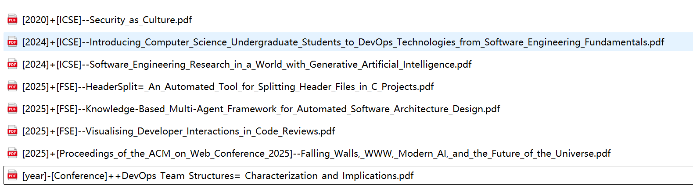

# 📄 PaperRename

**PaperRename** 是一个用于重命名学术论文 PDF 文件的工具，它能够：

- 自动提取 PDF 中的 DOI（支持 ACM、IEEE、arXiv 等）
- 查询 DOI 获取论文标题、作者、年份、会议/期刊
- 生成统一格式的文件名（避免非法字符）
- 自动重命名PDF的格式是 【年份】+【会议名】+【论文题目】（例如：`[2025]+[FSE]--Visualising_Developer_Interactions_in_Code_Reviews.pdf`）

#### 如图，下载论文时文件名不清楚或无意义的文件，都被重新直观地命名。

---

## ⚙️注意
1. acronym_map.json用于配置会议长名和简称，当扫描的文档所属的会议不在配置中时，会自动插入未知简称的会议全名，自行修改该行配置，以便后续支持更多会议的简称判断。
2. 自行修改会议全名时，注意删除 45th, 33rd等前缀，只保留 International Conferrence以后的部分，否则可能匹配不到。可以保留ACM或IEEE等前缀，但个别会议要另行配置
3. ❌doi.org网络访问不稳定并且部分DOI并未在此注册，IEEE官方API需要购买key，对于此类无法识别的PDF，当前的做法是仅读取文件解析论文标题并保存，会预留年份和会议名称，以便自行填充

## 🚀 安装与使用

1. 创建 python 虚拟环境
```bash
# 创建虚拟环境
python3 -m venv .venv
# 激活环境
source .venv/bin/activate
```

2. 安装以下 Python 依赖：

```bash
# 安装依赖
pip install -r requirements.txt
```
3. 使用
```
# 重命名该文件夹内的全部pdf
python rename [路径-文件夹名]
# 重命名指定的pdf
python rename [路径-文件名]
```

